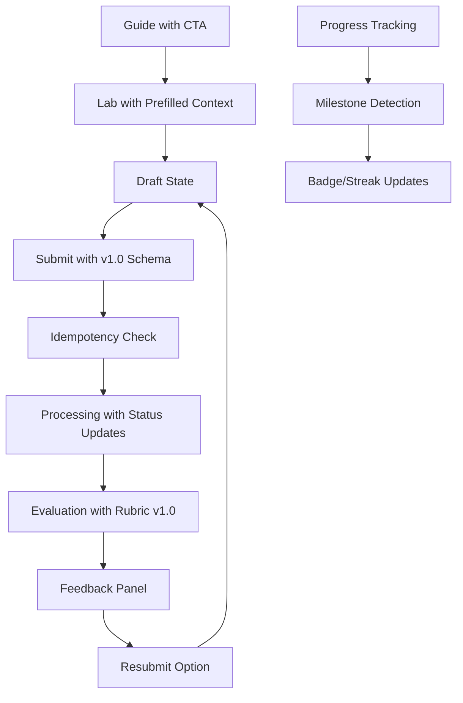

# Design Document - Prompt Practice App Refinement Phase

## Overview

This refinement phase transforms the functional MVP into a polished, beginner-friendly educational platform. The design focuses on clear learning progression, constructive feedback, robust data contracts, and accessibility compliance while maintaining the existing local-first architecture.

## Architecture

### Information Architecture Changes

```
Global Navigation: Learn | Practice | Progress | About
├── Learn (/guides)
│   ├── Guide Pages (/guides/[slug])
│   └── "Try in Lab" CTAs → Labs with prefilled context
├── Practice (/labs)
│   ├── Practice Basics (single model)
│   ├── Compare Basics (multi-model)
│   └── System Prompt Lab (placeholder)
├── Progress (/progress)
│   ├── Completion tracking
│   ├── Streak badges (dismissible)
│   └── Activity history
└── About (/about)
    └── Platform information
```

### Data Flow Enhancements



## Components and Interfaces

### 1. Global Navigation Component

**File:** `components/GlobalNav.tsx`

```typescript
interface GlobalNavProps {
  currentPath: string;
  className?: string;
}

interface NavItem {
  label: string;
  href: string;
  icon?: string;
  isActive: boolean;
}
```

**Features:**
- Persistent across all pages
- Keyboard navigation with skip link
- Active state indication
- Mobile-responsive hamburger menu

### 2. Lab Step Header Component

**File:** `components/LabStepHeader.tsx`

```typescript
interface LabStepHeaderProps {
  currentStep: 'draft' | 'submit' | 'feedback';
  status: StatusType;
  labTitle: string;
  onStepClick?: (step: string) => void;
}

interface StepIndicator {
  step: string;
  label: string;
  status: 'completed' | 'current' | 'pending' | 'error';
  icon: string;
}
```

**Visual States:**
- Draft: Edit icon, neutral colors
- Submit: Loading spinner during processing
- Feedback: Check/error icons with appropriate colors

### 3. Feedback Panel Component

**File:** `components/FeedbackPanel.tsx`

```typescript
interface FeedbackPanelProps {
  evaluation: EvaluationResult;
  rubricVersion: string;
  onResubmit: () => void;
  onGuideLink: (guideSlug: string) => void;
}

interface CriterionFeedback {
  criterionId: string;
  score: number;
  maxScore: number;
  explanation: string;
  exampleFix: string;
  relatedGuide?: string;
}
```

**Layout:**
- Friendly card design with constructive tone
- Per-criterion breakdown with visual scores
- Example fixes with code snippets
- Links to relevant guide sections
- Prominent "Resubmit" button

### 4. Design Token System

**File:** `styles/tokens.ts`

```typescript
export const tokens = {
  colors: {
    primary: '#2563eb',
    success: '#059669',
    warning: '#d97706',
    error: '#dc2626',
    neutral: {
      50: '#f9fafb',
      100: '#f3f4f6',
      // ... full scale
    }
  },
  spacing: {
    xs: '0.25rem',
    sm: '0.5rem',
    md: '1rem',
    lg: '1.5rem',
    xl: '2rem'
  },
  typography: {
    fontFamily: {
      sans: ['Inter', 'system-ui', 'sans-serif'],
      mono: ['JetBrains Mono', 'monospace']
    },
    fontSize: {
      xs: '0.75rem',
      sm: '0.875rem',
      base: '1rem',
      lg: '1.125rem',
      xl: '1.25rem'
    }
  },
  focus: {
    ring: '2px solid #2563eb',
    offset: '2px'
  }
};
```

## Data Models

### 1. Enhanced Attempt Schema v1.0

**File:** `schemas/attempt.schema.json`

```json
{
  "$schema": "http://json-schema.org/draft-07/schema#",
  "type": "object",
  "required": ["attemptId", "userId", "labId", "userPrompt", "models", "timestamp", "schemaVersion"],
  "properties": {
    "attemptId": { "type": "string", "pattern": "^[a-z0-9]{8}-[a-z0-9]{6}$" },
    "userId": { "type": "string", "default": "anonymous" },
    "labId": { "type": "string", "enum": ["practice-basics", "compare-basics", "system-prompt-lab"] },
    "userPrompt": { "type": "string", "maxLength": 2000 },
    "systemPrompt": { "type": "string", "maxLength": 1000 },
    "models": { 
      "type": "array", 
      "items": { "type": "string" },
      "minItems": 1,
      "maxItems": 3
    },
    "timestamp": { "type": "string", "format": "date-time" },
    "schemaVersion": { "type": "string", "const": "1.0" },
    "rubricVersion": { "type": "string", "default": "1.0" },
    "context": {
      "type": "object",
      "properties": {
        "sourceGuide": { "type": "string" },
        "prefillPrompt": { "type": "string" }
      }
    }
  }
}
```

### 2. Enhanced Evaluation Schema v1.0

**File:** `schemas/evaluation.schema.json`

```json
{
  "$schema": "http://json-schema.org/draft-07/schema#",
  "type": "object",
  "required": ["attemptId", "status", "timestamp", "schemaVersion"],
  "properties": {
    "attemptId": { "type": "string" },
    "status": { 
      "type": "string", 
      "enum": ["queued", "running", "success", "partial", "error", "timeout"] 
    },
    "results": {
      "type": "array",
      "items": {
        "type": "object",
        "properties": {
          "modelId": { "type": "string" },
          "response": { "type": "string" },
          "latency": { "type": "number" },
          "tokenCount": { "type": "number" },
          "source": { "type": "string", "enum": ["hosted", "sample", "local"] },
          "scores": {
            "type": "object",
            "properties": {
              "clarity": { "type": "number", "minimum": 0, "maximum": 5 },
              "completeness": { "type": "number", "minimum": 0, "maximum": 5 },
              "total": { "type": "number", "minimum": 0, "maximum": 10 }
            }
          },
          "feedback": {
            "type": "object",
            "properties": {
              "criterionId": { "type": "string" },
              "explanation": { "type": "string" },
              "exampleFix": { "type": "string" },
              "relatedGuide": { "type": "string" }
            }
          }
        }
      }
    },
    "error": {
      "type": "object",
      "properties": {
        "stage": { "type": "string" },
        "code": { "type": "string" },
        "message": { "type": "string" },
        "help": { "type": "string" },
        "retryable": { "type": "boolean" },
        "timestamp": { "type": "string", "format": "date-time" }
      }
    },
    "rubricVersion": { "type": "string", "default": "1.0" },
    "timestamp": { "type": "string", "format": "date-time" },
    "schemaVersion": { "type": "string", "const": "1.0" }
  }
}
```

### 3. Shared Enums and Contracts

**File:** `types/contracts.ts`

```typescript
export enum AttemptStatus {
  QUEUED = 'queued',
  RUNNING = 'running',
  SUCCESS = 'success',
  PARTIAL = 'partial',
  ERROR = 'error',
  TIMEOUT = 'timeout'
}

export interface ErrorContract {
  stage: string;
  code: string;
  message: string;
  help: string;
  retryable: boolean;
  timestamp: string;
}

export interface IdempotencyRecord {
  attemptId: string;
  status: AttemptStatus;
  timestamp: string;
  lockExpiry?: string;
}
```

## Error Handling

### 1. Idempotency Ledger

**File:** `lib/idempotency.ts`

```typescript
interface IdempotencyLedger {
  [attemptId: string]: IdempotencyRecord;
}

class IdempotencyManager {
  private ledgerPath = 'data/.idempotency.json';
  
  async acquireLock(attemptId: string): Promise<boolean>;
  async releaseLock(attemptId: string): Promise<void>;
  async getStatus(attemptId: string): Promise<AttemptStatus | null>;
  async updateStatus(attemptId: string, status: AttemptStatus): Promise<void>;
}
```

### 2. Structured Error Responses

All API endpoints return consistent error format:

```typescript
interface APIError {
  error: ErrorContract;
  attemptId?: string;
  timestamp: string;
}
```

### 3. Partial Results Handling

When model responses are incomplete:
- Store partial results with `status: 'partial'`
- Render available content with clear indicators
- Provide retry option for complete results
- Track partial completion in progress system

## Testing Strategy

### 1. Schema Validation Tests

**File:** `lib/__tests__/schemas.test.ts`

- Validate v1.0 schema compliance
- Test backward compatibility with existing data
- Verify required field enforcement
- Test enum value validation

### 2. State Transition Tests

**File:** `lib/__tests__/state-transitions.test.ts`

- Test all status transitions: queued → running → success/partial/error/timeout
- Verify idempotency ledger behavior
- Test concurrent request handling
- Validate retry mechanisms

### 3. Accessibility Tests

**File:** `lib/__tests__/accessibility.test.ts`

- Keyboard navigation paths
- Focus ring visibility
- Color contrast ratios (4.5:1 minimum)
- Screen reader compatibility
- 200% zoom functionality

### 4. Integration Tests

**File:** `lib/__tests__/guide-lab-integration.test.ts`

- Guide CTA → Lab prefill flow
- Context passing between components
- Progress tracking accuracy
- Badge/streak calculation

## Implementation Phases

### Phase 1: Foundation (Quick Wins - 1 day)
1. Schema v1.0 implementation
2. Shared contracts and enums
3. Basic design tokens
4. Global navigation structure

### Phase 2: Core UX (Sprint 1 - 3-5 days)
1. Lab step headers with visual states
2. Feedback panel with criterion breakdown
3. Guide content with CTAs
4. Lab prefill functionality

### Phase 3: Polish (Sprint 2 - 2-3 days)
1. Progress tracking and badges
2. Accessibility compliance
3. Comprehensive testing
4. Performance optimization

This design maintains backward compatibility while providing a clear path to a polished, educational platform that meets all accessibility and usability requirements.